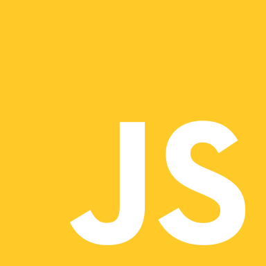
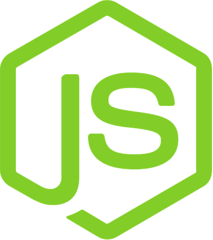
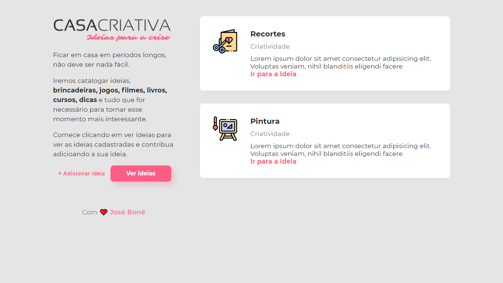
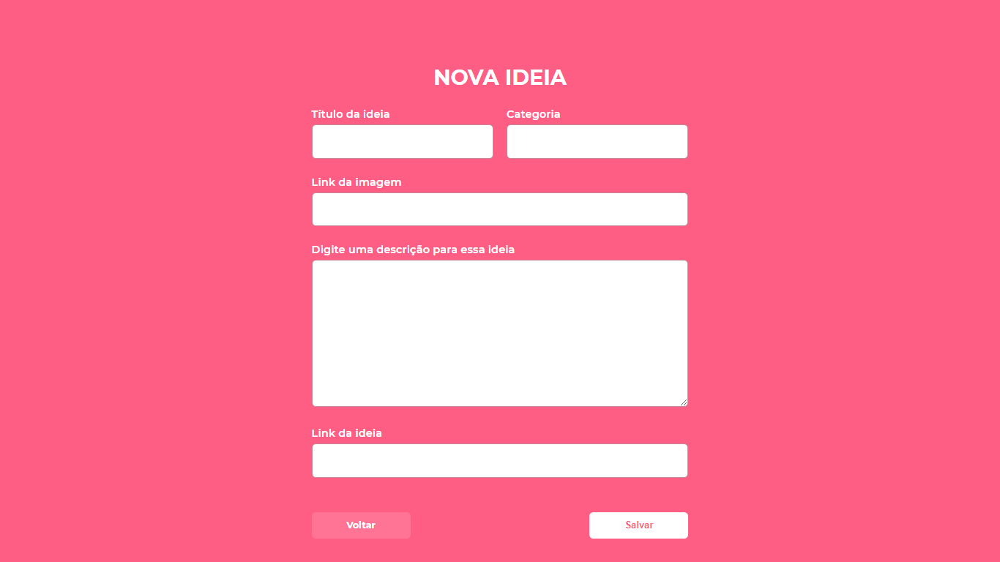
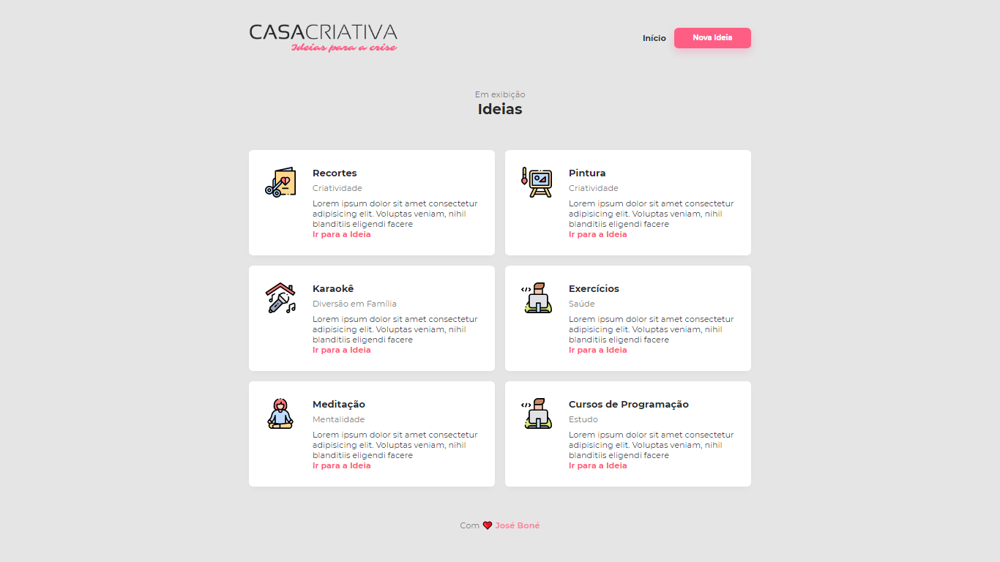

<h1 align="center">
  
</h1>

<h2 align="center">
  Registration system of ideas to make the moment
of confinement by Covid-19 most interesting
</h2>

<h3>
  Front-end
</h3>

<ul>
  <li>  <strong> HTML5 </strong> </li>
  <li>  <strong> CSS3 </strong> </li>
  <li>  <strong> JavaScript </strong> </li>
</ul>

<h3>
  Back-end
</h3>

<ul>
  <li>  <strong> Node.js </strong> </li>
  <li>  <strong> SQLite 3 </strong> </li>
</ul>

<h3>
  Dependencies
</h3>

- [Node.js](https://nodejs.org/)
- [Express](https://expressjs.com/)
- [SQLite3](https://sqlitebrowser.org/)
- [Nunjucks](https://www.npmjs.com/package/nunjucks)
- [VS Code](https://code.visualstudio.com/)

## 🚀 Requirements

To run the app, you will need [Git](https://git-scm.com), [Node.js](https://nodejs.org/) v12.13.1 or higher, [Npm](https://www.npmjs.com/), [SQLite3](https://sqlitebrowser.org/).
<br>

## 💻 Application

Now clone the repository and install the dependencies.

```bash
# to clone the repository
git clone https://github.com/jose-bone/casa-criativa.git

# go into the folder
cd casa-criativa

# install the backend dependencies
npm install

```

# run application

```bash
npm run dev
```

Access the application by **localhost: 3000**

## 🔖 Layout





---

## 📝 License

This project is under the [MIT](/LICENSE) license. See the file for more details.

<hr>

<h4 align="center">With ❤️ by <a href="https://github.com/jose-bone" target="_blank">José Boné</a>
</h4>
